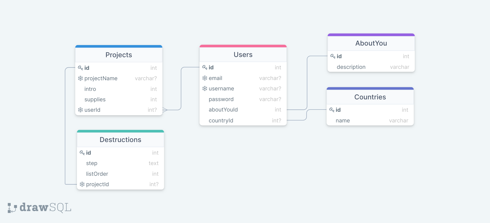

# README - Feature 1: Projects (includes adding/uploading media)

## Models Needed

* see schema from drawsql: 
  * Projects
    * projectId
    * projectName
    * intro
    * supplies
    * destructions
    * userId
    * categoryId
    * pageViews - STRETCH GOAL
    * likes - STRETCH GOAL

----------------------------------------------------------------
----------------------------------------------------------------

## Endpoints Needed

----------------------------------------------------------------

### CREATE

#### initialize creation of new project: '/create/'

* shows a page about creation
* has link to "/editInstructable/new"
* stepId 0 is the intro

#### create new project: /editInstructable/new

#### publish project: /editInstructable/publish/:projectId

----------------------------------------------------------------

### READ/VIEW A PROJECT

#### view a project by id: "/id/:projectName"

* if there's a duplicated project with the same name, they'll add a dash and a number

----------------------------------------------------------------

### UPDATE A PROJECT (should this be on a separate/same page for users' landing page?)

projectId is automatically generated with weird numbers and letters

#### editing/updating a new project: '/editInstructable/new'

* asks for the name of the project and confirmation to create
* after confirming project creation you are redirected to "/editInstructable/edit/:projectId"

#### edit an existing project: /editInstructable/edit/:projectId

* this is main project editing page

#### edit specific project steps: /editInstructable/edit/:projectId/step/:stepId

* same abilities to upload/embed media as main project edit page, except specific to step
* edit step page has three text boxes - one for step title, one for step contents, one for step supplies (supplies only if first step?).

----------------------------------------------------------------

### DESTROY A PROJECT (should this be on a separate/same page for users' landing page?)

#### route after project deletion: /editInstructable/deleted

* delete option in dropdown menu on /editInstructable/:projectId page. When you click delete a pop up appears for confimation - after confirming you are directed to /editInstructable/deleted which is basically a blank page.

----------------------------------------------------------------
----------------------------------------------------------------

## Templates Needed

READ
* read_project.pug
* layout.pug (nav-bar, header, footer, background image, a content div)

EDIT
* edit_project.pug

----------------------------------------------------------------
----------------------------------------------------------------

## Wire Frames or Sketches

----------------------------------------------------------------
----------------------------------------------------------------

## brainstorm

* adding media functionality is directly related to CREATING/UPDATING projects (included as separate feature for organizational purposes)
* adding comments functionality is directly related to READING projects route ('/id/:projectName')
* ~~projects model questions: I think there are two ways we can build the instructions for a project~~ (**ignore all of the following; see "project model thoughts"**)
   1. make each "destructable" (instruction) a separate instance of a model (with a listOrder on each instance)
      * I think each instance would need to be related to a destructionsList table.
      * would the destructionsList table have an array of destruction table ids that it would refer to? If so... why not have this list of destruction table ids directly on the project table and not have a destructionsList table?
        * WRONG - each individual destruction table would have a foreignKey of projectId on it, along with columns for listOrder (step number) and description (the step itself). By searching for desctructions where projectId = whatever we would grab only the destructions that apply to that project
      * The destructionsList table would sit between many destruction tables and a project table
      * The id of the destructionsList table would be a foreign key on the project table.
   1. have the instructions be a single array on ONE column in the project model

--------------------------------------------------------------;

Projects model thoughts

* our models would be something like

```CLI
//generate Project model. name is the title of the project; userId is a foreign key that points to the author; categoryId is a foreign key that points to the category

model:generate --name Project --attributes name:string,userId:integer,categoryId:integer;
.....
//generate Introduction model. title might be unnecessary but its the same idea as for Destruction model, description is the step itself, supplies is the supplies list (might be better to do as an array?), projectId is a foreign key that points to the project it belongs to

model:generate --name Introduction --attributes title:string,description:text,supplies:text,projectId:integer
.....

//generate Destruction model. listOrder indicates the step number (this would have to be related to other existing destructions for a particular project - implementation might be tricky); title is the heading for that particular step; description is the text instructions themselves; projectId is a foreign key that points to the project that the destruction belongs to

model:generate --name Destruction --attributes listOrder:integer,title:string,description:text,projectId:integer

```

* The way we could set up our model relationships is

```javascript
//Project model association
Project.has(models.Introduction, { foreignKey: projectId });
Project.hasMany(models.Destruction, { foreignKey: projectId });
//Introduction model association
Introduction.belongsTo(models.Project, { foreignKey: projectId });
//Destruction model association
Destruction.belongsTo(models.Project, { foreignKey: projectId });
//note that the projectId foreign key lives on the destruction and introduction models. No foreign key for destruction or introduction exists on the project model
```

* then, to get the instructions for a particular project we would say

```javascript
//for example, project with id of 1
const projectId = 1
//this would grab our project name, who created it, and the category
const project = Project.findByPk(projectId);
//this would grab "step 0" along with supplies, if provided.
const intro = Introduction.findAll({
  where:
    { projectId: projectId }
})[0];
//this would grab step 1 through the final step in an array, with all steps in order
const steps = Destruction.findAll({
  where:
    { projectId: projectId },
  orderBy: 'listOrder'
});
```
DAMN! YOU'VE BEEN WRITING A BUTT LOAD! (LB hehe)

...and not paying attention to lecture - IF
